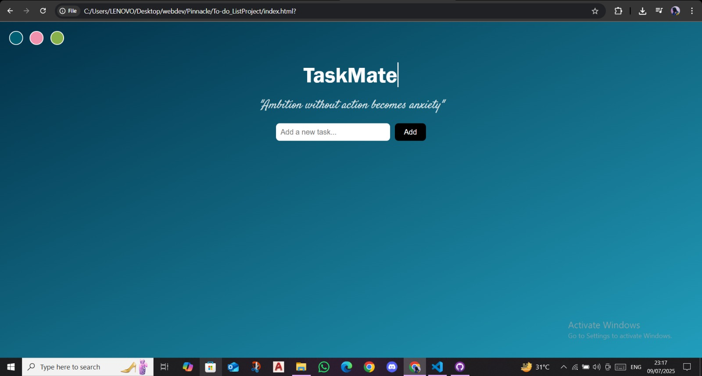
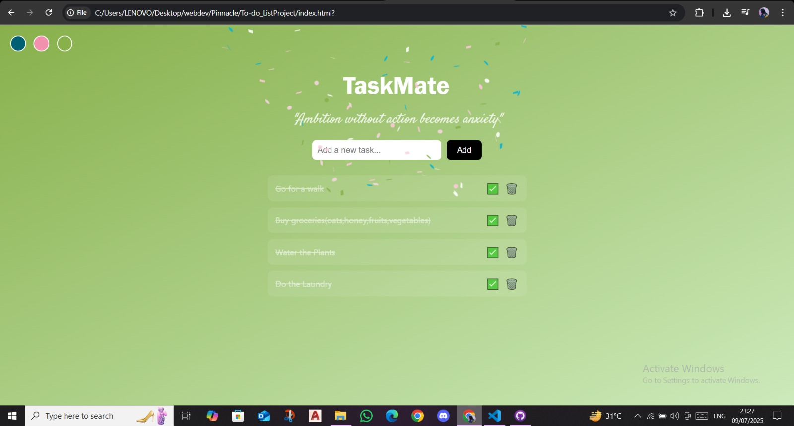
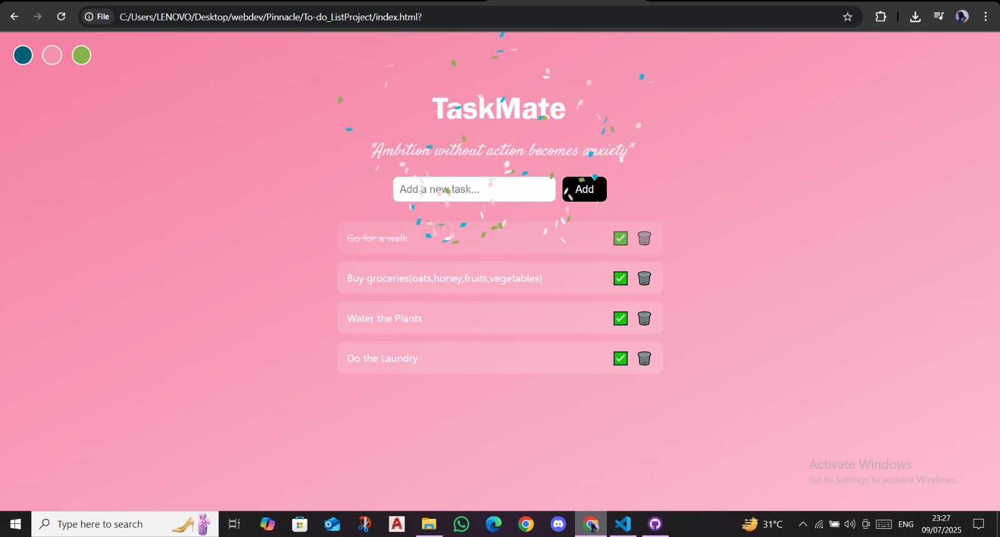

# TaskMate 🎯

**TaskMate** is a clean, minimal, and beautifully themed to-do list app designed for focus and fun. It's built using just HTML, CSS, and vanilla JavaScript — no frameworks, no fluff.

---

## ✨ Features

- ✅ Add, complete, and delete tasks
- 🔁 Persistent task saving with `localStorage`
- 🎉 Confetti and ding sound when tasks are completed
- 🎨 Switch between Ocean, Pastel, and Nature themes
- ✍️ Typewriter animation for the title
- 💬 Motivational quote below the heading
- 🖱️ Interactive UI with smooth animations

---

## 🖼️ Preview

---

## 🛠️ Tech Stack

- HTML5
- CSS3 (with Google Fonts + animations)
- JavaScript (ES6)
- `canvas-confetti` for celebration effects
- `localStorage` for persistence

---

## 🧠 Quote

> _"Ambition without action becomes anxiety"_  

---

## 🚀 Live Demo
[Click here to use TaskMate](https://shrutiji007.github.io/To-do_ListProject/)

---

## 🧑‍💻 Author

Made with ❤️ by [Shruti](https://github.com/Shrutiji007)

